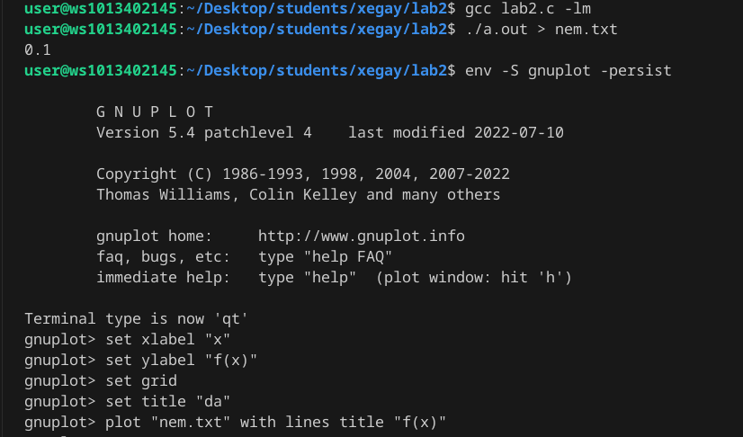
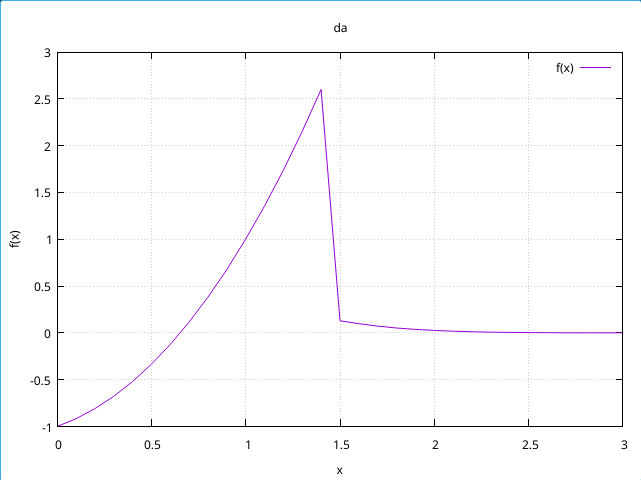
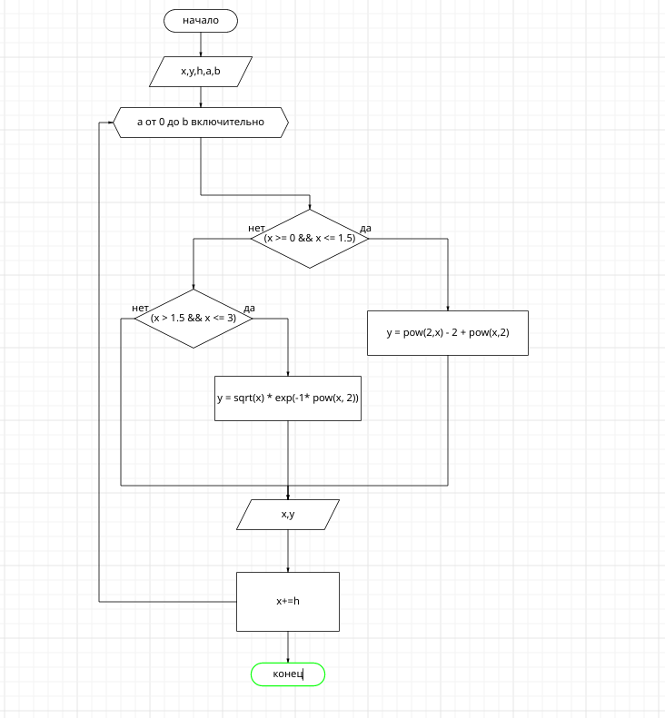

# 2 Лабораторная работа
## Задания
### 1. Напишите программу по варианту, используя оператор цикла while

```
#include <stdio.h>
#include <math.h>

int main()
{
  double x, y, h;
  x = 0.0;
  scanf("%lf", &h);
  int a, b;
  b=0
  a = 2 / h;
  while b<=a
  { b+=1
    if (x >= 0 && x <= 1.5)
      y = pow(2,x) - 2 + pow(x,2);  
    if (x > 1.5 && x <= 3)
      y = sqrt(x) * exp(-1* pow(x, 2)); 
    printf("%lf %lf\n", x, y);
    x += h; 
  }
}
```
### 2. Напишите программу, используя оператор цикла for


```
#include <stdio.h>
#include <math.h>

int main()
{
  double x, y, h;
  x = 0.0;
  scanf("%lf", &h);
  int a, b;
  a = 2 / h;
  for (b = 0; b <= a; b++)
  {
    if (x >= 0 && x <= 1.5)
      y = pow(2,x) - 2 + pow(x,2);  
    if (x > 1.5 && x <= 3)
      y = sqrt(x) * exp(-1* pow(x, 2)); 
    printf("%lf %lf\n", x, y);
    x += h; 
  }
}
```
### 3. Постройте график с использованием gnuplot
с помощью приведенных ниже команд мы вызываем инструмент gnuplot, после вводим в него параметры x и y


### 4. Составьте блок-схемы.

### 5. Оформите отчёт в README.md(готов)
